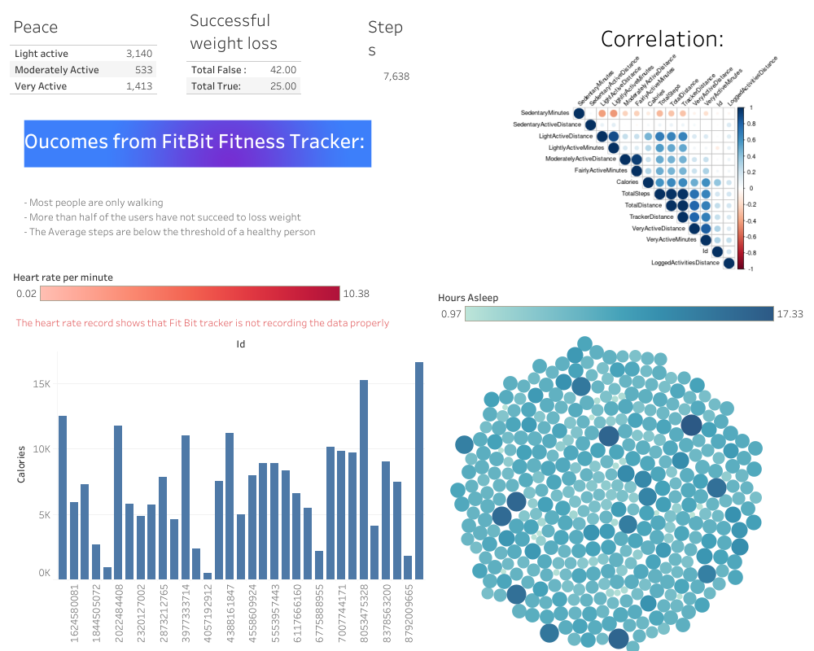

# Google Capstone Project
The final project of the Google Data Analytics Professional Certificate

# The Course 
Those who earn the Google Data Analytics Professional Certificatehave completed eight courses, developed by Google, that includehands-on, practice-based assessments and are designed to preparethem for introductory-level roles in Data Analytics. They are competentin tools and platforms including spreadsheets, SQL, Tableau, and R.They know how to prepare, process, analyze, and share data forthoughtful action.

# The Curriculum : 
- Foundations: Data, Data,Everywhere
- Ask Questions to Make Data-Driven Decisions
- Prepare Data for Exploration
- Process Data from Dirty to Clean
- Analyze Data to Answer Questions
- Share Data Through the Art of Visualization
- Data Analysis with R Programming
- Google Data Analytics Capstone: Complete a CaseStudy

# Scenario for the Capstone Project
I am a junior data analyst working on the marketing analyst team at Bellabeat,a high-tech manufacturer of health focused products for women.Bellabeat is a successful small company,but they have the potential to become a larger player in the
global smart device market.Urška Sršen,co-founder and Chief Creative Officer of Bellabeat,believes that analyzing smart device fitness data could help unlock new growth opportunities for the company.I have been asked to focus on one of Bellabeat’s products andanalyze smart device data to gain insight into how consumers are using their smart devices.The insights I discover will then help guide marketing strategy for the company.I will present mine analysis to the Bellabeat executive team along with mine high-level recommendations for Bellabeat’s marketing strategy.

#   Products :
- Bellabeat app : The Bellabeat app provides users with health data related to their activity, sleep, stress, menstrual cycle, and mindfulness habits. This data can help users better understand their current habits and make healthy decisions. The Bella beat app connects to their line of smart wellness products.
- Leaf : Bellabeat’s classic wellness tracker can be worn as a bracelet, necklace, or clip. The Leaf tracker connects to the Bellabeat app to track activity, sleep, and stress.
- Time : This wellness watch combines the time less look of a classic time piece with smart technology to track user activity, sleep, and stress. The Time watch connects to the Bella beat app to provide you with insights into your daily wellness.
- Spring : This is a water bottle that tracks daily water intake using smart technology to ensure that you are appropriately hydrated throughout the day. The Spring bottle connects to the Bella beat app to track your hydration levels.

# Content : 
- ASK 
- PREPARE
- PROCESS
- ANALYZE
- SHARE
- ACT

# Final Dashboard : 

# Suggestion to the business :

# Sources : 
- FitBit Fitness Tracker Data - https://www.kaggle.com/arashnic/fitbit
